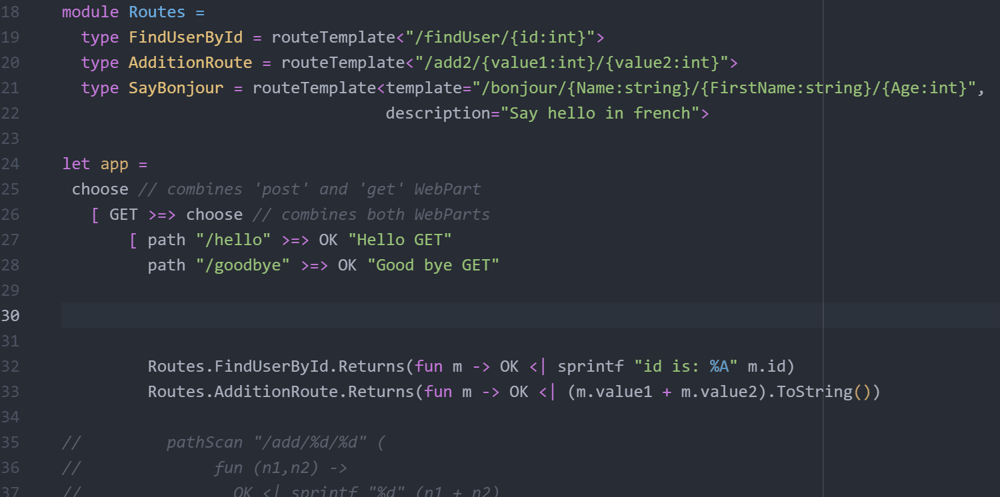
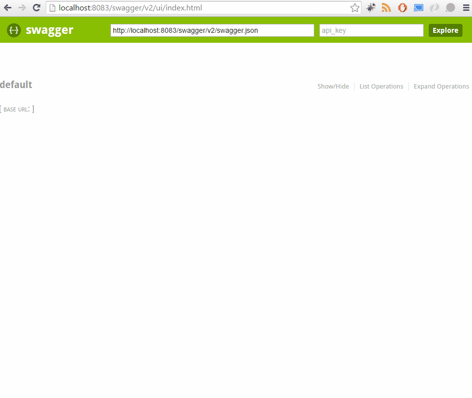

- title: From Zero to Hero of HTTP APIs
- description: How Suave was build and what it is now
- author: Henrik Feldt
- theme: night
- transition: default

***

<div style="display:none">
```fsharp
#r "../demos/say/packages/Suave/lib/net40/Suave.dll"
#r "../packages/slides/FParsec/lib/net40-client/FParsec.dll"
#r "../packages/slides/Chiron/lib/net40/Chiron.dll"
#r "../packages/slides/Arachne.Core/lib/net40/Arachne.Core.dll"
#r "../packages/slides/Arachne.Http/lib/net40/Arachne.Http.dll"
#r "../packages/slides/Arachne.Language/lib/net40/Arachne.Language.dll"
#r "../packages/slides/Arachne.Uri/lib/net40/Arachne.Uri.dll"
#r "../packages/slides/Suave.Locale/lib/net40/Suave.Locale.dll"
#r "../packages/slides/Suave.Testing/lib/net40/Suave.Testing.dll"
open Suave; open Suave.Successful; open Suave.Operators; open Suave.Filters
let executeProcess exe cmdline = "" // stub
```
</div>

### From Zero to Hero with HTTP APIs

***

## Agenda

 1. History
 1. Intro to HTTP
 1. F# for HTTP APIs
 1. Demo chat
 1. Demo deploy on minikube
 1. Patterns
 1. Further Resources
 


***

## Me

<dl>
  <dt>Name</dt>
  <dd>Henrik Feldt</dd>

  <dt>Producer of open source</dt>
  <dd>Suave, Expecto, Logary, Http.fs, Logibit.Hawk, Mailgun.fs, Fakta, albacore, dotliquid, F#'s docker image, ...</dd>

  <dt>Founder of</dt>
  <dd>[qvitoo.com – aims for AI accounting][qvitoo]</dd>
</dl>

***

## Why listen to this talk?

---

### Functionally curious.

---

### Interested in web server construction.

***

## Intro to HTTP

 - 

***

## Why Suave.IO

Ademar created it to make it possible for *everyone* to have a personal web server that's more or less free to run for a hosting company.

It stagnated a bit. A while later I came along and started pushing it towards production stability, by filing issues and doing
the needed testing and QA.

---

## Why Suave.IO

I wanted to make running micro-services **easy**. Was building a micro-services platform for my employer.

Suave became the solution. It's been running in production for 5 years now.

---

### Why continue?

Started a company – [qvitoo](https://qvitoo.com), wanted to build it right™.

And the community grew! People are using Suave for [IoT][s-iot], it's driving the [F# autocomplete][s-auto] service in Ionide, it's a complete OWIN server, a complete WebSockets server. Even this presentation runs on Suave with [FsReveal][s-reveal]!

---

### But still, all the time?

 - If everybody should learn to program, it should be fun!
 - I have a clear idea about how easy web development should be, and I want to share that idea with the world!

---

### But still, all the time?

 - The technical platform is turning more open:
  - F# has turned [Apache 2][fsharp]
  - [.Net Core][netcore] is showing promise
 - It could mean the old, walled-garden Microsoft is coming to an end
  - Or at least you're not in their walled cloud instead of their walled
    dev laptop

***

## Easy, I tell you!

Say whaat?

---

### Making it easy

```fsharp
let handle: WebPart =
  fun ctx ->
    async {
      let input = ctx.request.formData "to-say"
      match input with
      | Choice1Of2 input ->
        let out = executeProcess "say" input
        return! Redirection.FOUND "/" ctx
      | Choice2Of2 err ->
        return! RequestErrors.BAD_REQUEST err ctx
    }
```

---

### Now you talk!

Chat (if there's time, afterwards)

---

### Deployments must be easy!

minikube!

***

## Documenting your API



---

### Documenting your API (2)



[Look at Suave.Swagger][s-swagger]

---

### Documenting your API (3)

[Look at Suave.Swagger][s-swagger]

***

## Localising your app

Using [Suave.Locale][s-locale]:

```
open Arachne.Http; open Arachne.Language; open Suave.Locale; open Suave.Filters
let print (intl: IntlData) =
  OK (sprintf "You have locale '%O'" intl.locale)
let neg: LangNeg =
  Negotiate.negotiate
    [ ReqSources.parseQuery "locale"
      ReqSources.parseCookie "locale"
      ReqSources.parseAcceptable
      ReqSources.always (Range [ "en" ])]
    //[ LangSources.always (defaultLanguage appCtx.settings.rootPath) ]
    []
  |> Negotiate.assumeSource
let app =
  GET >=> path "/i18n/sample"
      >=> Api.negotiate neg print
      >=> Api.setVary
```

***

## More help!

 - [Suave site][suave]
 - [Suave Music Store](https://www.gitbook.com/book/theimowski/suave-music-store/details)
 - [F# applied](http://products.tamizhvendan.in/fsharp-applied/)
 - [API reference][suave-api]

***

## How does it work?

 1. Spawn a [listening socket][ref-bind]<br/><small><code>use listenSocket = new Socket(binding.endpoint.AddressFamily, SocketType.Stream, ProtocolType.Tcp)</code></small>
 1. For [every TCP connection][ref-conn], grab the client's socket <br/><small><code> let! r = transport.accept()</code></small>
 1. Parse the [HTTP request][ref-parse]<br/><small><code>let! result' = facade.processRequest _ctx</code></small>
 1. then [run your app][ref-app]<br/><small><code>let! result'' = HttpOutput.addKeepAliveHeader ctx |> HttpOutput.run consumer</code></small>
 1. Depending on whether your app returned [Bytes xs][ref-bytes], a [SocketTask task][ref-st] or [didn't do anything][ref-null], write the contents.

---

### Desirable properties

 - Fast (enough) – 10k requests per second
 - Async – support zipping a gigabyte file while processing other requests
 - Easy to get started – getting there
 - Liveness; lock-free – functional without state sharing
 – Safety; managed language
 - Hackable; you can extend it

' The only "dangerous" thing is the buffer management which we stress-/load-test

***

## Patterns

---

### Logging

```fsharp
open Suave.Logging
let logger = Targets.create Info [| "Suave" |]
let app =
  GET >=> choose [
    path "/" >=> OK "Hi"
    // more paths
  ] >=> logWithLevelStructured Info logger logFormatStructured
```

---

### Env vars

  * [12 factor apps][12fa]
  * [Kubernetes env var][kube-env]

---

### Server-per-test

 - [Expecto][expecto]
 - [Suave.Testing][suave-testing]
 - [Suave-server-per test][ref-server-per-test]

<code><pre>
open Expecto
open Expecto.Flip
open Suave.Testing

runWith defaultConfig (OK "Ho ho ho")
|> req HttpMethod.GET None id (fun resp ->
  resp.StatusCode
  |> Expect.equal "Should be unauthorised" Unauthorised
)
</code></pre>

***

### How do I get started?

  - [Fable Suave Scaffold](https://github.com/fable-compiler/fable-suave-scaffold/)
    - Write F#, run JS in the browser
    - Works with Webpack
  - [F# Forge template][forge]
  - [Watch a video][ndc-getting-started]

***

## More!!

---

### IoT state-machine engine

[Suave EvReact](https://github.com/unipi-itc/Suave.EvReact)

---

### Build nice presentations

[FsReveal](https://github.com/fsprojects/FsReveal)

---

### Authenticate with OAuth

[Suave.OAuth](https://github.com/SuaveIO/Suave.OAuth)

---

### Authenticate with Hawk

Stronger security

[Logibit Hawk](https://github.com/logibit/logibit.hawk/)

---

### Run WebSharper on Suave

[WebSharper and Suave](https://www.nuget.org/packages/WebSharper.Suave/)

---

### Azure functions

[Suave and Azure functions](https://www.nuget.org/packages/Suave.Azure.Functions/)


---

### Learn about HyperMedia!

[Hypermedia APIs with Suave](https://vimeo.com/album/2132360/video/171317244)

---

### Ship your JS logs to the server

[Logary SuaveReporter](https://www.nuget.org/packages/Logary.Services.SuaveReporter/)

---

### Learn about Hopac and Suave

[Building a chat](https://github.com/haf/suave-presentation.2015-09-03)

---

### DotLiquid with Suave

[Suave DotLiquid](https://www.nuget.org/packages/Suave.DotLiquid/)

---

### Razor with Suave

[Suave Razor](https://www.nuget.org/packages/Suave.Razor/)

---

### A HTML-esque DSL with Suave

[Example in Suave Music Store][suave-music-store-forms]

---

### What?

[Hypermedia-driven lambda calculus evaluator.](https://github.com/einarwh/hyperlamb)

***

## Now you try!

```bash
brew install mono git
git clone https://github.com/haf/zero-to-hero-talk.git
cd zero-to-hero
./build.sh
cd demos/say
mono paket.exe install
fsharpi app.fsx
```

---

### More from me

 - [Expecto – smooth testing for humans][expecto]
 - [Logary – Logs and metrics are one!][logary]
 - [YoLo – effing utilities][yolo]
 - [Http.fs – A simple, functional HTTP client library for F#][httpfs]
 - [F# in docker][fsharp-docker]

***

## Getting in touch

E-mail me at [henrik@qvitoo.com](mailto:henrik@qvitoo.com?subject=Suave), or tweet [@henrikfeldt](https://twitter.com/henrikfeldt). Also check out [qvitoo.com][qvitoo].

Follow [@funcprogsthlm](https://twitter.com/funcprogsthlm) and [@suaveio](https://twitter.com/suaveio) and [@foocafesthlm][https://twitter.com/foocafesthlm].

Chat with us [gitter.im/suaveio/suave](https://gitter.im/SuaveIO/suave).

Help out with Suave – tagged ["you-take-it"][suave-issues]

***

 [suave]: https://suave.io
 [suave-api]: https://suave.io/Suave.html
 [suave-testing]: https://www.nuget.org/packages/Suave.Testing
 [suave-issues]: https://github.com/SuaveIO/suave/issues?q=is%3Aopen+is%3Aissue+label%3Ayou-take-it
 [qvitoo]: https://qvitoo.com?utc_source=presentation&amp;utm_campaign=zero-hero
 [s-iot]: https://github.com/unipi-itc/Suave.EvReact
 [s-auto]: https://github.com/fsharp/FsAutoComplete
 [s-reveal]: https://github.com/fsprojects/FsReveal
 [s-swagger]: https://rflechner.github.io/Suave.Swagger/#/
 [s-locale]: 
 [fsharp]: https://github.com/fsharp/fsharp
 [netcore]: https://www.microsoft.com/net/core#macos
 [rflechnes-routes]: https://rflechner.github.io/SuavePresentation/#/5/1

 [ref-bind]: https://github.com/SuaveIO/suave/blob/master/src/Suave/Tcp.fs#L142
 [ref-conn]: https://github.com/SuaveIO/suave/blob/master/src/Suave/Tcp.fs#L172
 [ref-parse]: https://github.com/SuaveIO/suave/blob/master/src/Suave/ParsingAndControl.fs#L51
 [ref-app]: https://github.com/SuaveIO/suave/blob/master/src/Suave/ParsingAndControl.fs#L72
 [ref-bytes]: https://github.com/SuaveIO/suave/blob/master/src/Suave/HttpOutput.fs#L42
 [ref-st]: https://github.com/SuaveIO/suave/blob/master/src/Suave/HttpOutput.fs#L68
 [ref-null]: https://github.com/SuaveIO/suave/blob/master/src/Suave/HttpOutput.fs#L71

 [ref-server-per-test]: https://github.com/logibit/Logibit.Hawk/blob/master/src/Logibit.Hawk.Suave.Tests/Hawk.fs#L77-L96

 [12fa]: https://12factor.net/
 [kube-env]: https://kubernetes.io/docs/tasks/inject-data-application/distribute-credentials-secure/
 [forge]: http://forge.run/
 [expecto]: https://github.com/haf/expecto
 [logary]: https://github.com/logary/logary
 [httpfs]: https://github.com/haf/Http.fs
 [yolo]: https://github.com/haf/YoLo/
 [suave-music-store-forms]: https://theimowski.gitbooks.io/suave-music-store/content/en/logon_form.html
 [ndc-getting-started]: https://vimeo.com/album/2132360/video/171317244
 [fsharp-docker]: https://github.com/fsprojects/docker-fsharp